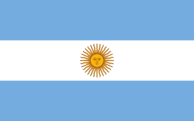
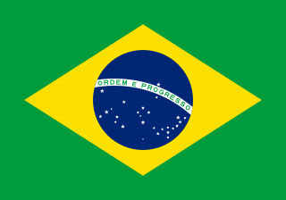
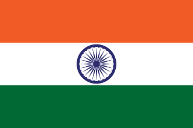
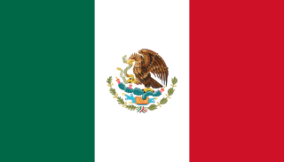
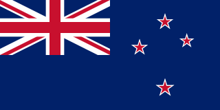
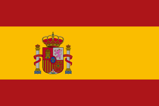
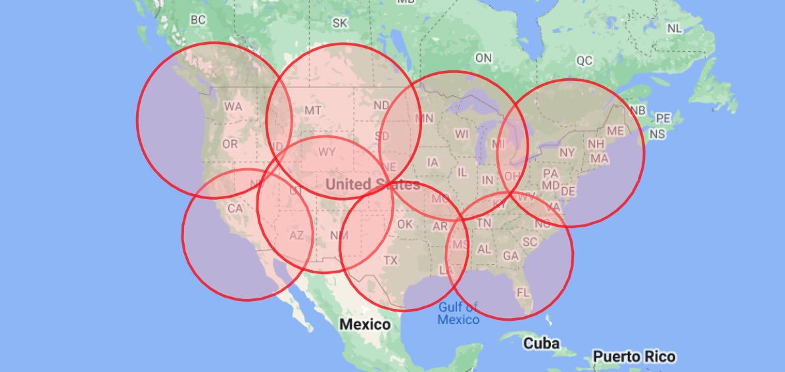

# facebook-marketplace-nationwide
_Nationwide Facebook Marketplace search using the least amount of tabs possible._

**Homepage:**
<a href="https://www.browsemarketplaces.com/" target="_blank">https://www.browsemarketplaces.com</a>

### How to use

You must be logged into Facebook, disable your ad/popup blockers, allow browser to open multiple tabs.

### Countries supported

 Argentina 
 Australia 
 Brazil 
 Canada 
 France 
 India 
 Mexico 
 New Zealand 
 Spain 
 United Kingdom 
 USA lower 48 states 
 USA all 50 states 

_Sample coverage (USA lower 48): _

_Thanks to @kylemd, @jnsjunior, @kwbr1_

### Changelog

* 2024-05-14 – `?throttle=` URL param in milliseconds to delay tab opening
* 2024-05-12 – Delivery search filter (stealth), UI & search params tweaks, hidden `?throttle=1` URL param
* 2024-05-11 – Search filters: Sort By, Condition, Availability, Days Since Listed
* 2024-05-10 – Support for Argentina, United Kingdom, France, Spain and New Zealand
* 2024-05-09 – Support for Brazil, help from jnsjunior@GitHub and kwbr1@GitHub
* 2023-07-28 – Support for India
* 2023-07-03 – V2 with new design, fixed coverage for countries with kms as locale
* 2023-06-28 – Support for USA w/Alaska & Hawaii
* 2023-03-30 – Support for Australia (credit: kylemd@GitHub) and Mexico
* 2022-09-19 – Added How To Use video
* 2022-09-12 – Tool did not work without setting a 500 miles radius first
* 2021-11-28 – Support for Canada
* 2020-09-30 – Fixed 500 miles radius, use Local Delivery flag

### Roadmap
* ~~Search filters~~
* Support for Categories
* More countries

### Made With
 

