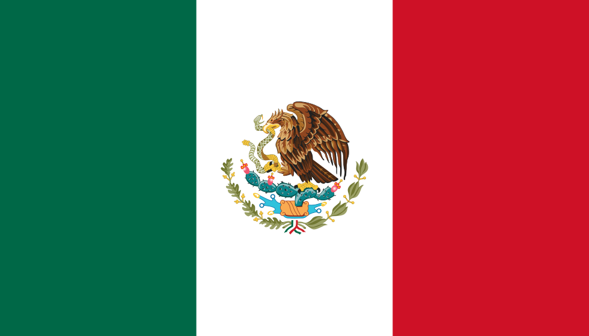

# facebook-marketplace-nationwide
_Nationwide Facebook Marketplace search using the least amount of tabs possible._

**Homepage:**
<a href="http://facebook-marketplace-nationwide-search.gmoz.biz" target="_blank">http://facebook-marketplace-nationwide-search.gmoz.biz</a>

### How to use

You must be logged into Facebook, disable your ad/popup blockers, allow browser to open multiple tabs.

### Countries supported

 Argentina 
 Australia 
 Brazil 
 Canada 
 France 
 India 
 Mexico 
 New Zealand 
 Spain 
 United Kingdom 
 USA lower 48 
 USA all 50 states 

_Thanks to @kylemd, @jnsjunior, @kwbr1_

### Roadmap
* Add more countries
